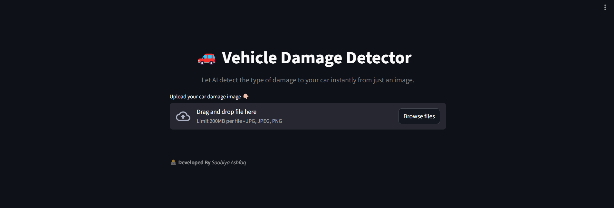
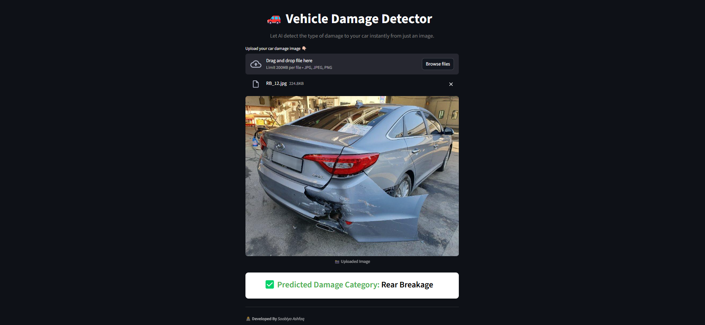

<div align="center">


<h1 align="center"> Vehicle Damage Detection App </h1>

[](https://huggingface.co/spaces/sashfaq911/Car_Damage_Detector)


</div>

<p align="center">
  <a href="#problem-statement">Problem Statement</a> •
  <a href="#features">Features</a> •
  <a href="#app-overview-&-usage">App Overview & Usage</a> •
  <a href="#live-demo">Live Demo</a> •
  <a href="#installation-&-deployment">Installation</a> •
  <a href="#acknowledgements">Acknowledgements</a> •
  <a href="#license">License</a>
</p>


An end-to-end AI application for vehicle damage classification using **FastAPI** (backend), **Streamlit** (frontend), and **PyTorch** (deep learning). This app let's you drag and drop an image of a car and teslls you what kind of damage it has.


## 🛑 Problem Statement  <a name="problem-statement"></a>
Vehicle accidents often result in damages that need quick assessment for insurance claims and repair cost estimation. Manual inspection is time-consuming, subjective, and prone to human error. There is a need for an automated solution that can classify the type of car damage accurately and efficiently, making the claims and repair process faster and more reliable.

## 💡 Solution Statement  
This project provides an AI-powered vehicle damage detection system built on a **ResNet50 deep learning model**. The system is deployed on **Hugging Face Spaces**, combining a **FastAPI backend** for inference and a **Streamlit frontend** for user interaction. Users can upload an image of a damaged car, and the application instantly classifies the type of damage, showcasing practical skills in computer vision, API design, and full-stack AI deployment.

Here's a screenshot below of what the app looks like:



## ✨ Features <a name="features"></a>
- Upload a car image and get instant damage classification through a clean **Streamlit UI**.  
- Detects and classifies damages into:  
  - Front Normal  
  - Front Crushed  
  - Front Breakage  
  - Rear Normal  
  - Rear Crushed  
  - Rear Breakage  
- Fine-tuned **ResNet50** model for accurate vehicle damage detection.  
- **Modern Architecture** →  
  - **FastAPI backend** serving predictions via REST API  
  - **Streamlit frontend** for interactive visualization  
-  End-to-end app deployed on **Hugging Face Spaces**, accessible from any browser.  
- Backend validated with **Postman** for reliability and easy integration with other systems.  


## 🖥️ App Overview & Usage <a name="app-overview-&-usage"></a>





### 📸 Image Upload & Display
- Users upload a car image (JPG/PNG) through the **Streamlit interface**.  
- Uploaded files are kept in memory by Streamlit and displayed immediately for confirmation.  

### ⚡ Prediction via FastAPI Backend
- The uploaded image is sent to the **FastAPI backend** (`/predict` endpoint) for analysis.  
- If the backend is unavailable, the app **automatically falls back** to the local model.  

### 🖼️ Preprocessing & Model Inference
- The image is resized, normalized, and converted into a tensor.  
- A **pre-trained ResNet50 model** predicts one of six car damage categories:  
  - 🚗 Front Normal  
  - 💥 Front Crushed  
  - 🔧 Front Breakage  
  - 🚗 Rear Normal  
  - 💥 Rear Crushed  
  - 🔧 Rear Breakage  
- Model performance on the validation set is around 80% accuracy.

### ✅ Prediction Output
- The predicted damage class is instantly displayed in a **styled result box** on Streamlit.  
- Users can quickly see the **type of damage** and understand the car’s condition at a glance.

### ⏩ Architecture Flow
**User → Streamlit Frontend → FastAPI Backend → Model Helper (`model_helper.predict`) → Prediction Result → Streamlit Frontend → User**

**Flow Description:**
1. User uploads image → Streamlit Frontend  
2. Streamlit sends image → FastAPI Backend (`/predict`)  
3. FastAPI passes image → Model Helper (`model_helper.predict`)  
4. Model processes image → Returns predicted damage class  
5. FastAPI sends prediction → Streamlit Frontend  
6. Streamlit displays prediction → User sees result

## 🌐 Live Demo <a name="live-demo"></a>

Try the app here: **[Vehicle Damage Detection](https://huggingface.co/spaces/sashfaq911/Car_Damage_Detector)**


## 🛠️ Tech Stack

- **Python**, **PyTorch**
- **FastAPI** → backend
- **Streamlit** → frontend
- **Docker** → deployment
- **HuggingFace Spaces** → cloud hosting


## 📦 Project Structure

```bash
Vehicle_Damage_Detection/
│
├── model/                         
│   ├── saved_model.pth             # Trained ResNet50 model weights
│
├── LICENSE                         # Apache License file
├── README.md                       # Project documentation
├── requirements.txt                # Python dependencies
├── app.py                          # Streamlit frontend application
├── backend.py                      # FastAPI backend for inference requests
├── model_helper.py                 # Model loading and utility functions
├── supervisord.conf                # Process manager configuration
├── Dockerfile                      # Container specification for deployment
└── .gitattributes                  # Git configuration for large files and line endings
```


## 🚀 Installation & Deployment <a name="installation-&-deployment"></a>
The app is deployed on **Hugging Face Spaces** and accessible here:  
👉 [Live Demo](https://huggingface.co/spaces/sashfaq911/Car_Damage_Detector)  

This project consists of a **FastAPI backend** for predictions and a **Streamlit frontend**. You can run it locally with Python, or run using Docker.


### 🐍 Option 1 — Run Locally (Python + pip)

#### Prerequisites:  
- Python 3.10+

1. **Clone the repo**:
   ```bash
   git clone https://github.com/sashfaq911/Vehicle_Damage_Detection.git
   cd Vehicle_Damage_Detection
   ```
2. **Create a virtual environment**:   
   ```commandline
   python -m venv venv
   source venv/bin/activate  # On Windows: venv\Scripts\activate
   ```
3. **Install dependencies**:   
   ```commandline
    pip install -r requirements.txt
   ```
4. **Run FastAPI backend**:  
   ```commandline
    uvicorn backend:app --reload --host 0.0.0.0 --port 8000
   ```
   - The backend will be available at →  http://localhost:8000
     
5. **Run the Streamlit frontend**:
   
   Open a second terminal and run:   
   ```commandline
    streamlit run app.py
   ```
 - The frontend will open at →  `http://localhost:8000`
 - It communicates with the backend wia API requests.

6. **Access the app**:
- Local URL: `http://localhost:8501`
- Network URL (for LAN access): e.g., `http://10.108.0.87:8501`
- External URL (if deployed): e.g., `http://52.1.65.187:8501`


### 🐳 Option 2 — Run with Docker

1. Build the image
```commandline
docker build -t car-damage-app .
```

2. Run container exposing both ports
```commandline
docker run -d -p 8501:8501 -p 8000:8000 car-damage-app
```

3. **Access your app**:
- FastAPI Backend → `http://localhost:8000`
- Streamlit Frontend → `http://localhost:8501`


## 🙏 Acknowledgements <a name="acknowledgements"></a>

A special thanks to [Dhaval Patel](https://www.linkedin.com/in/dhavalsays/) and [Hemanand Vadivel](https://www.linkedin.com/in/hemvad/) for their guidance through the [CodeBasics Gen AI & Data Science BootCamp](https://codebasics.io/bootcamps/dashboard/ai-data-science-bootcamp-with-virtual-internship). This project has been an invaluable learning experience and a key milestone in my data science journey!


## 📄 License <a name="license"></a>

This project is licensed under the **Apache License 2.0**. See the [LICENSE](./LICENSE) file for details.


## ❤️  Support

Contributions, issues, and suggestions are welcome!

Give a ⭐️ if you like this project!
